# 统一开发环境Docker使用说明

推荐使用Docker进行代码开发，对开发环境进行统一管理。本地机器安装Nvidia驱动即可，cuda/cudnn/pytorch等开发工具在容器中统一
Docker官方文档：https://docs.docker.com/get-started/
Docker概念及常用命令：https://my-ichery.feishu.cn/slides/KKvvszHuVllcBYdFRBecrfyenah

## 基础镜像信息
使用pytorch官方base镜像：pytorch/pytorch:2.8.0-cuda12.9-cudnn9-runtime（具体详见Dockerfile）
- ***python版本：Python 3.11.13，Docker中的路径：/opt/conda/bin/python，VsCode连进容器后需要更改python解释器路径***
- python版本可自行升级

## 基础环境安装
### 1. Docker安装
```shell
# 卸载旧版本（如果有）
sudo apt remove docker docker-engine docker.io containerd runc
sudo apt update
sudo apt install -y ca-certificates curl gnupg lsb-release

# 添加Docker官方GPG密钥
sudo mkdir -p /etc/apt/keyrings
curl -fsSL https://download.docker.com/linux/ubuntu/gpg | sudo gpg --dearmor -o /etc/apt/keyrings/docker.gpg

# 添加Docker软件源
echo \
  "deb [arch=$(dpkg --print-architecture) signed-by=/etc/apt/keyrings/docker.gpg] \
  https://download.docker.com/linux/ubuntu \
  $(lsb_release -cs) stable" | \
  sudo tee /etc/apt/sources.list.d/docker.list > /dev/null

# 更新并安装Docker
sudo apt-get update
sudo apt-get install -y docker-ce docker-ce-cli containerd.io docker-compose-plugin

# 将当前用户加入docker组，避免每次都用sudo
sudo usermod -aG docker $USER
# 退出并重新登录终端生效，或者执行：
newgrp docker
```
Docker可配置代理，加速国内镜像的拉取
```shell
# 编辑/etc/docker/daemon.json（如果没有需要创建）
sudo vim /etc/docker/daemon.json
# 加入以下内容
"registry-mirrors": [
    "https://docker.m.daocloud.io",
    "https://mirror.iscas.ac.cn",
    "https://docker.nju.edu.cn",
    "https://mirror.sjtu.edu.cn",
    "https://registry.aliyuncs.com"
]
```
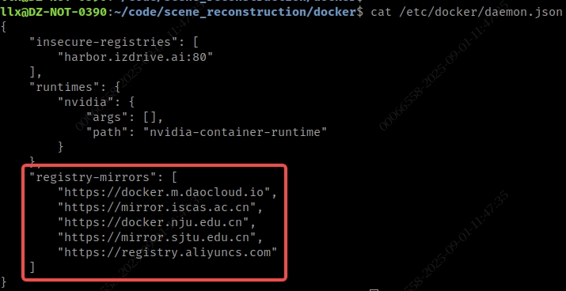

### 2. Nvidia驱动安装（apt方式）
```shell
sudo apt update
# 检测可用驱动版本
ubuntu-drivers devices
# 输出会显示类似如下信息，recommended表示推荐的版本
driver   : nvidia-driver-535 - distro non-free recommended
# 自动安装推荐驱动（推荐）
sudo ubuntu-drivers autoinstall
# 或手动指定版本，例如
sudo apt install -y nvidia-driver-535
# 重启系统
sudo reboot

# 验证是否有效
nvidia-smi
```
NOTE：其余安装方式，如官网run文件或者PPA最新驱动可自行查阅操作

### 3. 安装NVIDIA Container Toolkit
NVIDIA Container Toolkit 是 NVIDIA 官方提供的一套工具，可以让 Docker / Podman / Kubernetes 等容器能够直接使用宿主机上的 NVIDIA GPU
```shell
# 配置安装源
curl -fsSL https://nvidia.github.io/libnvidia-container/gpgkey | sudo gpg --dearmor -o /usr/share/keyrings/nvidia-container-toolkit-keyring.gpg \
  && curl -s -L https://nvidia.github.io/libnvidia-container/stable/deb/nvidia-container-toolkit.list | \
    sed 's#deb https://#deb [signed-by=/usr/share/keyrings/nvidia-container-toolkit-keyring.gpg] https://#g' | \
    sudo tee /etc/apt/sources.list.d/nvidia-container-toolkit.list

# 配置使用experimental功能
sed -i -e '/experimental/ s/^#//g' /etc/apt/sources.list.d/nvidia-container-toolkit.list

sudo apt update

# 安装
export NVIDIA_CONTAINER_TOOLKIT_VERSION=1.17.8-1
sudo apt-get install -y \
    nvidia-container-toolkit=${NVIDIA_CONTAINER_TOOLKIT_VERSION} \
    nvidia-container-toolkit-base=${NVIDIA_CONTAINER_TOOLKIT_VERSION} \
    libnvidia-container-tools=${NVIDIA_CONTAINER_TOOLKIT_VERSION} \
    libnvidia-container1=${NVIDIA_CONTAINER_TOOLKIT_VERSION}

# 配置Docker使用 NVIDIA Runtime
sudo nvidia-ctk runtime configure --runtime=docker
sudo systemctl restart docker

# 测试GPU是否可用
docker run --rm --gpus all nvidia/cuda:12.2.0-base nvidia-smi
```

***

## 本代码仓库中Docker开发环境使用
为方便使用，提供shell脚本进行容器的启动/进入/停止等操作，这里WORKSPACE当做代码仓的主目录，即WORKSPACE=/path/to/scene_reconstruction
```shell
# 进入到docker目录
cd ${WORKSPACE}/docker
# 首次需要构建镜像
bash build.sh
# 构建成功后进入容器，--imgv指定镜像的tag（版本），若不指定，默认取最新tag，使用多版本情况
bash docker_run.sh  --imgv=20250912164159
# 停止容器（需要的话，一般退出运行的容器直接输入exit或者Ctrl-D即可，
# 但exit不会停止容器，会后台运行，下次运行docker_run.sh依然进去相同容器）
bash docker_stop.sh  # 真正停止容器，下次docker_run.sh启动新容器
```

***关于镜像构建***
正常运行build.sh通过Dockerfile构建镜像，会依赖一些外网的资源，构建时间很久。当前有两种方法
##### 1. 翻墙后配置代理
首先ifconfig在本地查看容器ip，一般是172.17.0.1，翻墙后一般会有一个代理端口可以在翻墙软件中查看，然后构建镜像的时候当作参数传进去。
若配置生效构建时间在30分钟左右
```shell
# [port]因翻墙软件不同
bash build.sh --http_proxy="socks5://172.17.0.1:[port]" --https_proxy="socks5://172.17.0.1:[port]"
```
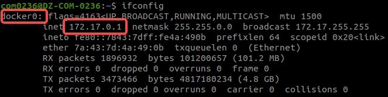
##### 2. 将编译完成的镜像打包好，运行docker命令直接加载
更适用于华为云GPU机器没有接入外网的场景
```shell
# 当前镜像构建完成后，叫做scene/cuda12.1_py39_pyt241:latest
docker save scene/cuda12.1_py39_pyt241:latest | gzip > scene_cuda12.1_py39_pyt241.tar.gz

# 如果只是使用从这一步开始就可以，不用关心打包镜像
gunzip -c scene_cuda12.1_py39_pyt241.tar.gz | docker load
# 加载成功后运行确认有scene/cuda12.1_py39_pyt241 tag的镜像
docker images
```
后续使用和上述介绍相同
```shell
bash docker_run.sh
# or
bash docker_stop.sh
```

***NOTE***
- 一个WORKSPACE对应一个容器，可以理解为一个代码目录使用docker_run.sh脚本只能启动一个运行的容器，多次执行只是进入这个容器，容器的名字对应代码目录

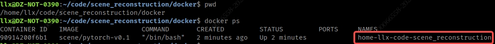

- 正常在容器中想要退出，直接输入exit即可（或Ctrl-D）

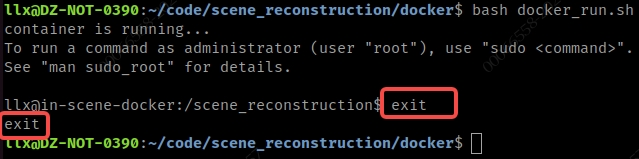

- 停止容器，需要使用docker_stop.sh，会根据目录索引到容器的NAME，停止掉你的WORKSPACE对应容器，不要使用原生的docker stop命令，容易误删别人目录对应的容器
- ***容器启动后，会将WORKSPACE挂载在容器内部的/scene_reconstruction目录，即在宿主机WORKSPACE开发的内容，会和容器内/scene_reconstruction同步，反之亦然，谨慎删除操作***

***

## 容器中运行训练脚本
```shell
cd /scene_reconstruction
# 不同脚本参数可能不一致，跑不通请自行调试
bash scripts/chery/experiments/0902_train_visual_front_main.sh
```

运行过程中pytorch会下载一些在线模型

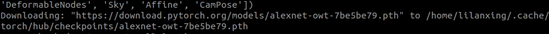

如果在测试GPU环境没有外网的情况下，可以在有网环境下载好远程拷贝到容器固定目录
```shell
# 在目标机器（这里是训练GPU资源）代码仓库中新建tmp文件夹，用于和容器的数据交互
mkdir -p /path/to/scene_reconstruction/tmp

# 在有网机器
wget https://download.pytorch.org/models/alexnet-owt-7be5be79.pth
scp alexnet-owt-7be5be79.pth {user}@172.26.254.12:/path/to/scene_reconstruction/tmp

# 在目标机器上进入容器内部(bash docker_run.sh)
# pwd is /scene_reconstruction
mkdir -p ~/.cache/torch/hub/checkpoints/
cp /path/to/scene_reconstruction/tmp/alexnet-owt-7be5be79.pth ~/.cache/torch/hub/checkpoints/

bash scripts/chery/experiments/0902_train_visual_front_main.sh
```

## VsCode连接Docker容器进行开发
vscode用的不是很熟，辛苦大家自己也多尝试
### 安装Extensions
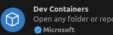
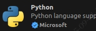
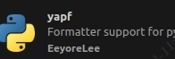

### 先启动容器
cd ${WORKSPACE}/docker && bash docker_run.sh
然后点击vscode左下角的蓝色label，选择Attach to Running Container，再选择对应运行的容器即可
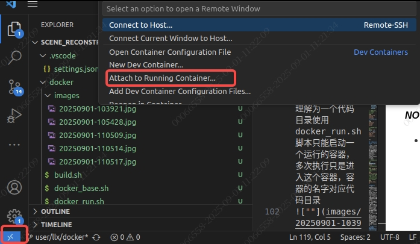

### 更改Attach用户为非root
首次attach进容器时，vscode使用的是root用户，会导致在WORKSPACE修改的文件用户组变为root，在容器外部没有权限打开。容器启动时，会在内部创建和宿主机当前相同的用户，所以需要把VsCode attach的设置进行修改
Ctrl-Shift-P选择Open Attached Container Configuration file，再选择scene/pytorch-v0.1会打开一份json文件
在文件中加入"remoteUser": "llx"保存退出vscode，再次打开并重新attach
注：llx仅示例，请修改为本地用户

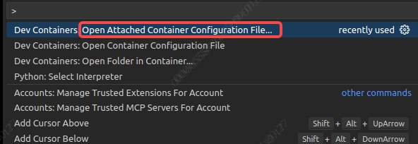

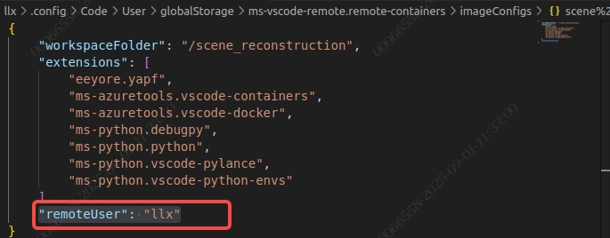

***

## Release Note

### 20250912

- 镜像构建时新增tag，tag默认是构建时间，单位到秒，构建成功后如下

  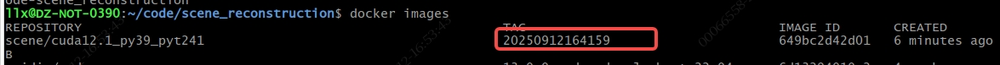

- 运行docker_run.sh时，可指定tag，和不同版本镜像做区分，参数为--imgv=[tag]，若不指定，默认选最新

  ```shell
  bash docker_run.sh --imgv=20250912164159
  ```
- 挂载宿主机/data/sfs_turbo进容器的/Data目录
- pip包改动
  - numpy==1.26.4（新增）
  - nuscenes-devkit==1.2.0（新增）
  - opencv-python==4.11.0.86（原4.12.0.88，不兼容numpy2.0以下，降级）
- 环境变量新增网络代理，以便在华为云gpu上可通过pip安装包
  - http_proxy=http://172.26.255.17:3128
  - https_proxy=http://172.26.255.17:3128
  - ftp_proxy=http://172.26.255.17:3128

### 20250919
- ***cuda版本为12.1***，后续有需要再升级
- 镜像中新增三个conda环境，进入容器默认激活main，各环境基本信息如下
  - main
    - 主要功能：运行预处理脚本与主程序（训练）
    - python: 3.9
    - pytorch: 2.3.1
    - pytorch3d: 0.7.8
    - 执行数据与处理：bash scripts/chery/preprocess_data.sh
    - 执行主程序：bash scripts/chery/experiments/0902_train_visual_front_main.sh
    - ***注意***：预处理与主程序之间还有sky_mask，需要在segformer或mmseg2中运行
  - segformer（按照RADME中部署的版本）
    - python: 3.8
    - pytorch: 1.8.1
    - mmcv-full: 1.2.7
    - SegFormer：git最新版（4年前更新）
    - 执行提取sky_mask脚本：bash scripts/chery/extract_sky_masks.sh
    - ***注意***：segformer使用的pytorch不支持sm_90，即我们使用的H100，仅能在自己开发机运行，***segformer环境不推荐使用***
  - mmseg2
    - python: 3.9
    - pytorch: 2.1.2
    - mmcv: 2.1.0
    - mmsegmentation: 1.2.2
    - 执行提取sky_mask脚本：***bash scripts/chery/extract_sky_masks_mmseg2.sh***
    - ***注意***： 此环境使用最新版mmsegmentation替换segformer（最新版集成了segformer），***建议使用此环境进行mask提取***

