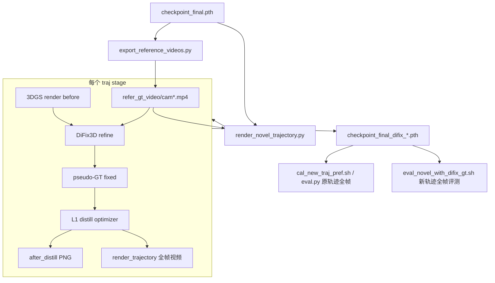

# 新轨迹 DiFix3D 渐进式混合蒸馏方案

本文档描述当前 Qcraft/Chery 分支中**新轨迹在线修复 + 渐进式混合蒸馏**的完整方案，包括训练流程、参数含义、输出目录与评测方式。

> 快速上手见 [NewTrajectoryQuickStart.md](./NewTrajectoryQuickStart.md)；本文档聚焦蒸馏方案本身。

---

## 1. 背景与目标

### 1.1 问题

基础 3DGS 场景重建完成后，在原训练轨迹上渲染质量较好，但在**新轨迹**（如横向平移 `left_shift_1m`）上渲染会出现明显退化（模糊、伪影、几何不一致等）。新轨迹没有真实 GT 图像，无法直接用原轨迹的 PSNR/SSIM 监督。

### 1.2 解决思路

1. **DiFix3D 在线修复**：对新轨迹渲染图做单帧修复，生成 pseudo-GT（`fixed`）。
2. **L1 蒸馏回 3DGS**：以 `fixed` 为目标，优化 3DGS 参数，使新轨迹渲染逼近修复结果。
3. **原轨迹 GT replay**：在渐进式 stage 中交替插入 `original_traj` stage，用真实 GT 像素拉回原视角质量，防止蒸馏后原轨迹退化。

### 1.3 当前默认 stage 序列

入口脚本 [`sim_render/cam/render_novel_trajectory_online.sh`](../sim_render/cam/render_novel_trajectory_online.sh) 默认配置：

```text
left_shift_1m → original_traj → left_shift_2m → original_traj → left_shift_3m → original_traj
distill_stage_repeats: (3, 6, 3, 6, 3, 6)
```

- **新轨迹 stage**（`left_shift_*m`）：DiFix 修复 + 蒸馏，repeat = 3
- **原轨迹 stage**（`original_traj`）：GT 像素 replay，repeat = 6

---

## 2. 端到端流程



### 2.1 前置条件

1. 已完成基础场景训练，得到 `checkpoint_final.pth` 及同目录 `config.yaml`。
2. DiFix3D 模型已安装（默认路径见参数表）。
3. GPU 显存充足（全帧 DiFix + 多样本缓存可能 OOM，见 FAQ）。

### 2.2 执行顺序

| 步骤 | 脚本/模块 | 说明 |
|------|-----------|------|
| 1 | `export_reference_videos.py` | 从原轨迹 GT 像素导出 per-cam 参考视频 |
| 2 | `render_novel_trajectory.py` | 按 stage 顺序执行 DiFix 蒸馏 + 全帧视频渲染 |
| 3 | `cal_new_traj_pref.sh`（可选，online.sh 内置） | 蒸馏后对**原轨迹**做全帧 PSNR/SSIM/LPIPS |
| 4 | `eval_novel_with_difix_gt.sh`（独立运行） | 对**新轨迹**做全帧 pseudo-GT 评测 |

---

## 3. 核心代码模块

| 模块 | 文件 | 职责 |
|------|------|------|
| 批处理入口 | [`sim_render/cam/render_novel_trajectory_online.sh`](../sim_render/cam/render_novel_trajectory_online.sh) | 默认参数、GPU 选择、config 拷贝、步数预估 |
| 蒸馏/渲染核心 | [`sim_render/cam/render_novel_trajectory.py`](../sim_render/cam/render_novel_trajectory.py) | `run_difix_distill_one_traj`、`export_difix_eval_one_traj`、`render_trajectory` |
| GT ref 视频 | [`sim_render/cam/export_reference_videos.py`](../sim_render/cam/export_reference_videos.py) | 导出 `refer_gt_video/cam{id}.mp4`，供 DiFix `ref_image` |
| 轨迹定义 | [`utils/camera.py`](../utils/camera.py) | `left_shift_*m`、`original_traj` 等轨迹函数 |
| 新视角数据 | [`datasets/driving_dataset_novel_view.py`](../datasets/driving_dataset_novel_view.py) | 轨迹 → 每帧 `cam_infos` / `image_infos` |
| 原轨迹评测 | [`scripts/qcraft/cal_new_traj_pref.sh`](../scripts/qcraft/cal_new_traj_pref.sh) | 调用 `tools/eval.py` 全帧评测 |
| 新轨迹评测 | [`scripts/qcraft/eval_novel_with_difix_gt.sh`](../scripts/qcraft/eval_novel_with_difix_gt.sh) | 全帧渲染 + before/fixed/after 指标 |
| 评测逻辑 | [`tools/eval_novel_with_difix_gt.py`](../tools/eval_novel_with_difix_gt.py) | `run_difix_eval_all_frames` + 指标聚合 |

---

## 4. 单 stage 蒸馏细节

核心函数：`run_difix_distill_one_traj()`（[`render_novel_trajectory.py`](../sim_render/cam/render_novel_trajectory.py)）

### 4.1 新轨迹 stage（`stage_mode = "novel"`）

适用于 `left_shift_1m`、`left_shift_2m` 等（非 `original_traj`）。

1. **构建轨迹**：`dataset.get_novel_render_traj(traj_type=...)` 生成新轨迹 pose 序列。
2. **帧子采样**：对 `distill_cam_ids` 中每个相机，调用 `_select_distill_frame_indices()` 选取帧（默认 stride=3 → 0, 3, 6, ...）。
3. **DiFix 修复**（逐帧、逐相机）：
   - 3DGS 渲染 → `before` PNG
   - DiFix3D(`before`, ref_image=同帧原轨迹 GT) → `fixed` PNG（pseudo-GT）
   - 可选保存 `ref` PNG
4. **缓存蒸馏样本**：`(frame_data, fixed_u8)` 加入 `novel_samples`。
5. **Progressive 优化**（当设置了 `distill_stage_repeats`）：
   - 总步数 = `len(stage_samples) × stage_repeat`
   - 每轮 shuffle 样本顺序，逐步 L1 回传（`_distill_one_step`）
6. **导出 after**：对子采样帧重新渲染 → `after_distill` PNG。
7. **全帧视频**：stage 结束后调用 `render_trajectory()`，渲染**全部 timeline 帧**并保存 mp4/图片。

### 4.2 原轨迹 stage（`stage_mode = "original"`）

需开启 `--distill_ref_traj_as_original_stage`。当 `traj_type == difix_ref_traj_type`（默认 `original_traj`）时触发。

- **不做 DiFix**，不生成 before/fixed PNG。
- 从原轨迹 GT 像素（`refer_gt_video` 或 dataset 直接读取）构建 `original_replay_samples`。
- 同样受 `distill_frame_stride` 子采样。
- repeat 通常设更大（默认 6），用于恢复/维持原视角质量。

### 4.3 损失函数

```python
distill_loss = L1(pred_rgb, target_rgb)  # novel view 渲染 vs DiFix fixed 或 GT 像素
```

优化器由 `_build_distill_optimizer()` 构建，默认 Adam，`lr = distill_lr × distill_lr_scale`。

### 4.4 两种蒸馏调度模式

| 模式 | 触发条件 | 行为 |
|------|----------|------|
| **Progressive（当前默认）** | 设置了 `--distill_stage_repeats` | 每个 stage 独立 repeat，样本 shuffle 后确定性遍历 |
| **Legacy mixed** | 未设置 `distill_stage_repeats` | 总步数 = `max(distill_steps, 样本数×100)`；若 `--distill_mix_original`，按 `distill_original_sample_ratio` 随机混合 novel/original 样本 |

当前 `render_novel_trajectory_online.sh` 使用 **Progressive** 模式，且 `distill_mix_original=false`（原轨迹 replay 通过独立 stage 实现，而非随机混合）。

---

## 5. 训练子采样 vs 评测全帧

这是当前方案的关键设计：**蒸馏训练省算力，评测覆盖全帧**。

| 阶段 | 帧策略 | 原因 |
|------|--------|------|
| 蒸馏 / DiFix 训练 | `distill_frame_stride=3` 子采样 | 降低 DiFix 推理次数、优化步数与显存占用 |
| stage 后视频渲染 | `render_trajectory()` 全 timeline | 可视化完整新轨迹 |
| 新轨迹指标评测 | `--render_all_frames` → `difix_eval_all_frames_*` | 指标覆盖全部帧 |

### 5.1 两类 PNG 目录

| 目录 | 帧数 | 用途 |
|------|------|------|
| `difix_distill_all_frames_{suffix}/` | 子采样（stride 影响） | 蒸馏过程 debug；**不应用于正式指标** |
| `difix_eval_all_frames_{suffix}/` | 全 timeline | 正式新轨迹 pseudo-GT 评测 |

`suffix` 映射规则（`_difix_distill_dir_suffix`）：

| traj_type | suffix |
|-----------|--------|
| `left_shift_1m` | `1_0` |
| `left_shift_1.5m` | `1_5` |
| `left_shift_2m` | `2_0` |
| `left_shift_3m` | `3_0` |
| `original_traj` | `original_traj` |

---

## 6. 步数估算

Progressive 模式下，总优化步数：

```text
distill_frames = len(timeline_indices[::stride])   # distill_use_all_frames=true 时
samples_per_stage = num_cams × distill_frames
total_steps = Σ (samples_per_stage × stage_repeat[i])
```

**示例**（197 帧 timeline，stride=3，11 相机，repeats 合计 27）：

```text
distill_frames = 66        # 0, 3, 6, ..., 195
samples_per_stage = 11 × 66 = 726
total_steps = 726 × 27 = 19,602
```

启动前 `render_novel_trajectory_online.sh` 会通过 Python 脚本打印预估步数。代码侧对应 `_estimate_progressive_distill_steps()`。

---

## 7. 配置参数表

以下参数来自 [`render_novel_trajectory_online.sh`](../sim_render/cam/render_novel_trajectory_online.sh) 默认值，均可通过 bash 环境变量覆盖。

### 7.1 输入与输出

| 参数 | 默认值 | 说明 |
|------|--------|------|
| `ckpt_path` | 场景 `checkpoint_final.pth` | 蒸馏起始 checkpoint |
| `experiment_output_dir` | `./output_scene_data_step_left_1` | 实验输出根目录（`log_dir`） |
| `final_fix_ckpt_suffix` | `difix_prog_left1p5_ori_1` | 最终 checkpoint 文件名后缀 |
| `difix_output_suffix` | `difix_left1p5_ori_1` | 视频/图片输出后缀 |

### 7.2 Stage 与轨迹

| 参数 | 默认值 | 说明 |
|------|--------|------|
| `traj_types` | `left_shift_1m, original_traj, ...` | stage 顺序 |
| `distill_stage_repeats` | `(3 6 3 6 3 6)` | 每个 stage 的 repeat 次数 |
| `distill_ref_traj_as_original_stage` | `true` | 将 `original_traj` 识别为 GT replay stage |
| `distill_ref_cam_id` | `0` | 轨迹生成的参考相机 |
| `distill_cam_ids` | 11 路相机 | 参与蒸馏的相机列表 |

### 7.3 帧控制

| 参数 | 默认值 | 说明 |
|------|--------|------|
| `distill_use_all_frames` | `true` | 使用全 timeline（再经 stride 子采样） |
| `distill_frame_stride` | `3` | 蒸馏帧步长（3 → 每 3 帧取 1 帧） |
| `distill_max_frames` | `-1` | 限制最大蒸馏帧数（-1 不限制） |

### 7.4 DiFix3D

| 参数 | 默认值 | 说明 |
|------|--------|------|
| `difix_src_dir` | `.../Difix3D-main/src` | DiFix pipeline 源码 |
| `difix_pretrained_dir` | `.../Difix3D-main/difix_ref` | 预训练权重 |
| `difix_use_original_traj_ref` | `true` | 使用原轨迹 GT 作为 `ref_image` |
| `difix_ref_video_dir` | `{experiment_output_dir}/refer_gt_video` | per-cam 参考视频目录 |
| `difix_ref_traj_type` | `original_traj` | 参考轨迹类型 |
| `difix_prompt` | `remove_degradation` | DiFix prompt |
| `difix_num_inference_steps` | `1` | 推理步数 |
| `difix_timesteps` | `(199)` | DiFix timestep |
| `difix_guidance_scale` | `0.0` | CFG scale |

### 7.5 优化

| 参数 | 默认值 | 说明 |
|------|--------|------|
| `distill_lr` | `1e-4` | 蒸馏学习率 |
| `distill_lr_scale` | `1.0` | 全局 LR 倍率 |
| `distill_steps` | `14800` | Legacy 模式总步数（Progressive 模式下不使用） |
| `distill_mix_original` | `false` | Legacy 模式随机混合原轨迹样本 |
| `distill_original_sample_ratio` | `0.65` | Legacy 模式原轨迹采样比例 |

### 7.6 评测（online.sh 内置 / 独立脚本）

| 参数 | 默认值 | 说明 |
|------|--------|------|
| `eval_original_traj_after_distill` | `true` | 蒸馏结束后自动跑原轨迹 eval |
| `eval_postfix` | `prog_mix_original_traj` | 原轨迹 eval 视频后缀 |
| `eval_render_full` | `true` | 原轨迹全帧评测 |
| `ckpt_path_before` | （评测脚本必填） | 蒸馏前 checkpoint，用于新轨迹 before/fixed |

---

## 8. 输出目录结构

以 `experiment_output_dir` 为根：

```text
experiment_output_dir/
├── config.yaml                          # 从源 checkpoint 目录拷贝
├── refer_gt_video/
│   ├── cam0.mp4                         # 原轨迹 GT 参考视频
│   ├── cam1.mp4
│   └── ...
├── difix_distill_all_frames_1_0/        # left_shift_1m 蒸馏 debug PNG（子采样）
│   ├── cam0_frame000000_before.png
│   ├── cam0_frame000000_fixed.png
│   ├── cam0_frame000000_after_distill.png
│   └── ...
├── difix_distill_all_frames_original_traj/  # 原轨迹 stage（通常无 before/fixed）
├── difix_eval_all_frames_1_0/           # 评测全帧 PNG（eval 脚本生成）
├── novel_traj/
│   ├── left_shift_1m_step{N}_difix_left1p5_ori_1/
│   │   ├── videos/left_shift_1m.mp4     # 全帧渲染视频
│   │   └── images/                      # 逐帧图片（若 save_images=true）
│   └── ...
├── checkpoint_final_difix_prog_left1p5_ori_1.pth   # 蒸馏最终 checkpoint
├── metrics_eval/                        # 原轨迹 eval 指标（online.sh 自动触发）
│   └── images_full_*.json
└── metrics_novel_difix/                 # 新轨迹 pseudo-GT eval 指标
    └── novel_difix_pseudo_gt_metrics_*.json
```

---

## 9. 运行命令

### 9.1 蒸馏（推荐入口）

```bash
cd /path/to/scene_reconstruction
export PYTHONPATH=$(pwd)

ckpt_path=/path/to/checkpoint_final.pth \
experiment_output_dir=/path/to/output \
bash sim_render/cam/render_novel_trajectory_online.sh
```

蒸馏完成后，online.sh 默认自动调用 `cal_new_traj_pref.sh` 对**原轨迹**做全帧评测。

### 9.2 新轨迹 + 原轨迹完整评测

```bash
experiment_dir=/path/to/output \
ckpt_path=/path/to/output/checkpoint_final_difix_xxx.pth \
ckpt_path_before=/path/to/checkpoint_final.pth \
bash scripts/qcraft/eval_novel_with_difix_gt.sh
```

- **Part 1**：`tools/eval.py` — 原轨迹全帧 vs 真实 GT
- **Part 2**：`tools/eval_novel_with_difix_gt.py` — 新轨迹全帧 vs DiFix pseudo-GT
  - `before_vs_fixed`：蒸馏前 3DGS vs DiFix fixed
  - `after_vs_fixed`：蒸馏后 3DGS vs DiFix fixed

若全帧 PNG 已存在，可跳过渲染：

```bash
skip_render_all_frames=true \
experiment_dir=/path/to/output \
ckpt_path=... \
ckpt_path_before=... \
bash scripts/qcraft/eval_novel_with_difix_gt.sh
```

### 9.3 仅渲染（不带蒸馏）

```bash
export PYTHONPATH=$(pwd)
python sim_render/cam/render_novel_trajectory.py \
  --resume_from /path/to/checkpoint_final.pth \
  --traj_types left_shift_1m left_shift_2m \
  --cam_ids 0 1 2 3 5 6 7 9 10 11 12 \
  --downscales 1 1 1 1 1 1 1 1 1 1 1 \
  --fps 10 \
  --render_rgb \
  --save_images \
  log_dir=/path/to/output
```

---

## 10. 支持的轨迹类型

定义于 [`utils/camera.py`](../utils/camera.py) 的 `get_interp_novel_trajectories()`：

| traj_type | 说明 |
|-----------|------|
| `original_traj` | 原训练轨迹 |
| `left_shift_0.2m` ~ `left_shift_5m` | 横向平移（含 0.2/0.4/0.5/0.6/0.8/1/1.5/2/2.5/3/5 m） |
| `change_lane_2m` 等 | 其他预定义轨迹（见 camera.py） |

---

## 11. 常见问题

### Q1: 蒸馏过程中 OOM（进程被 Killed）

- 增大 `distill_frame_stride`（如 3 → 5），减少 DiFix 推理与样本缓存。
- 减少 `distill_cam_ids` 中的相机数量做调试。
- 确保每帧 DiFix 后及时 `torch.cuda.empty_cache()`（代码已做，但全 cam 全帧仍可能爆显存）。

### Q2: 中断后能否从某个 stage 继续？

**当前不支持 stage 级 resume**。中断后需从初始 `checkpoint_final.pth` 重跑全部 stage。若在最后阶段完成后崩溃，可能已有中间 checkpoint 但无 `checkpoint_final_difix_*.pth`（仅在全部 stage 结束后保存）。

### Q3: `original_traj` stage 的 difix 目录为空或没有 before/fixed？

**正常现象**。原轨迹 stage 只做 GT replay 蒸馏，不跑 DiFix，因此不产生 before/fixed PNG。

### Q4: 新轨迹评测为什么要 `ckpt_path_before`？

`fixed`（DiFix pseudo-GT）是对**蒸馏前** 3DGS 渲染结果做修复得到的。`before_vs_fixed` 和 `after_vs_fixed` 都需要同一份 `fixed` 作为 GT，因此需要蒸馏前的 checkpoint 来生成 before + fixed；蒸馏后的 checkpoint 仅用于 after 渲染。

### Q5: `config.yaml` 找不到

蒸馏与评测均要求 `experiment_output_dir/config.yaml` 存在。online.sh 会自动从源 checkpoint 目录拷贝；手动运行时需自行复制。

### Q6: 子采样 PNG 和全帧评测指标不一致？

预期行为。`difix_distill_all_frames_*` 仅覆盖 stride 子采样帧；正式指标应使用 `eval_novel_with_difix_gt.sh`（默认 `--render_all_frames`）生成的 `difix_eval_all_frames_*`。

---

## 12. 相关文档

- [NewTrajectoryQuickStart.md](./NewTrajectoryQuickStart.md) — 新轨迹最短上手路径
- [Qcraft.md](./Qcraft.md) — Qcraft 数据集与预处理
- [Chery.md](./Chery.md) — Chery 数据说明
