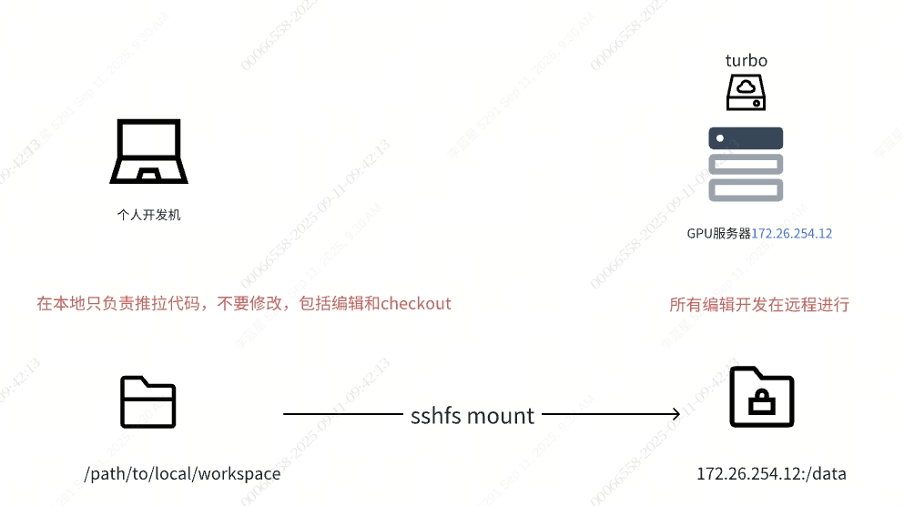
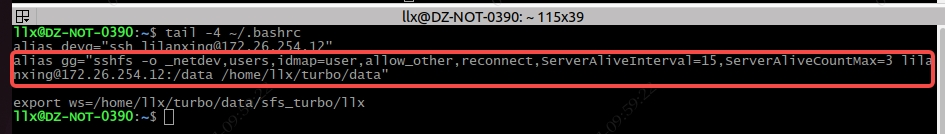
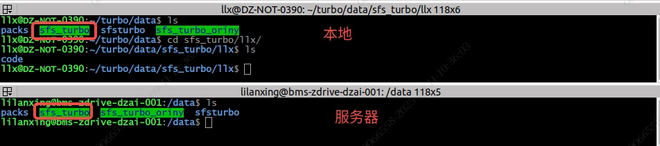

# 公用GPU开发机开发手顺

> 开发机：ssh user@172.26.254.12
> 本机器是多方公用的远程华为云GPU环境，此文档简要描述与本地协作的开发模式

开发机挂载了类似云盘的容器，后称turbo，大致的开发模式如下



## 挂载方式
##### 1. 在本地机器新建一个workspace目录，用于远程挂载
```shell
mkdir -p /path/to/workspace
```
##### 2. 在开发机使用sshfs命令挂载服务器
```shell
sudo apt install sshfs
sshfs user@172.26.254.12:/data /path/to/workspace
```
##### 3. 登录服务器进行开发
```shell
ssh user@172.26.254.12
# do your job in /data
```

## 开发注意事项
> 个人的一些经验和踩的坑

##### 是否配置自动挂载
就我某天晚上调试的情况看，服务器任务比较多，用的人多，有时候会出现ssh很卡甚至连不上的问题
此时配置自动挂载sshfs可能会导致开机启动失败，或者一直重试也挂不上，也依赖网络
个人采用了一个折中的方案，在个人配置文件中alias别名方便操作，终端输入
```shell
# 挂载云盘
~$ gg
# 登录服务器
~$ devg
```
PS: 本地生成ssh秘钥后可配置免密登录更方便
```shell
ssh-copy-id -i ~/.ssh/id_rsa.pub user@172.26.254.12
```



##### 挂载好之后，大概长这样



/data都是公用的，目前我们项目主要使用/data/sfs_turbo目录，可以在下面建立个人目录

##### 在哪里开发代码？
个人建议是：所有操作都在远程服务器进行开发
为什么？

- 我们的模式是在本地机器挂载了服务器的云盘，再进入本地挂载目录操作，有时候会很卡！！！你在服务器源文件夹列出目录毫秒级，在本地机器ls可能得1-2秒，git status等命令也很卡
- ~~**对于公司电脑，本地有代码加密，在没有安装加密软件的机器（服务器就没有）上，很容易显示乱码，我们的py代码无法运行**（非公司电脑可以忽略这一条）~~
- **上面那条不适用了，正常有加密软件的机器，拉代码下来都是加密的，在服务器都是乱码，目前是找IT下发了解密策略**

##### 服务器没有外网怎么办？
核心原则还是所有编辑开发都登录远程服务器进行操作

所有需要下载的资源，如开源模型等，在本地机器下好后，传到服务武器

###### 对于git
代码只能在本地网络拉取，正常使用git clone等命令

亲测：***~~clone之后checkout或者编辑(vim)保存(vscode)某个文件，在服务器上打开就乱码了~~***

***现在是git clone下来的代码，在服务器看就是乱码了，不过我用的是vim，vscode远程连不上去***

个人经验是只在本地进行git clone/pull/push等操作，剩下的checkout/diff等全在服务器

一旦有一次在本地机器进行编辑，服务器代码就会被加密，不好解决

###### 关于数据文件等
最好还是在远程机器操作，有需要的话scp拷过去

比如解压一个tar.gz的包，在本地挂载的目录和服务器源目录，耗时完全不是一个量级

代码和数据，包括该下载的资源都在服务器具备之后，可以尝试卸载挂好的盘，需要的时候再挂上来，本地的挂载，也可能影响服务器拔刀的速度